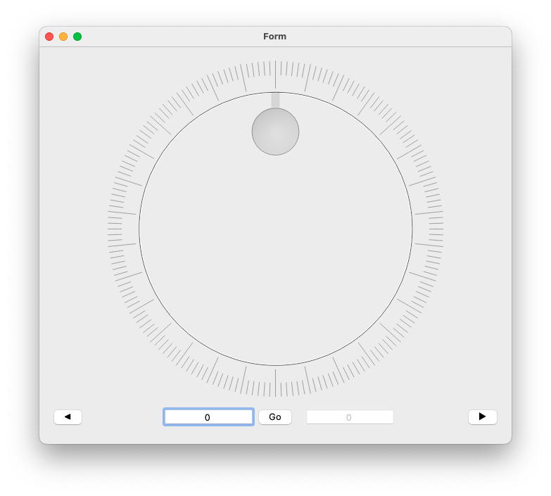

# EEE_CLP_LaunchingPLatform
Application for the EEE CLP Launching Platform

# Install Package
Use the following command to install all required package
```
pip install -r requirements.txt
```

# UI

